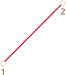
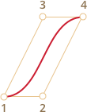
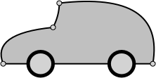
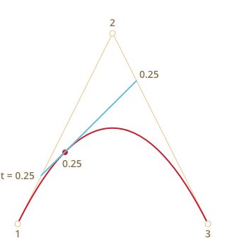
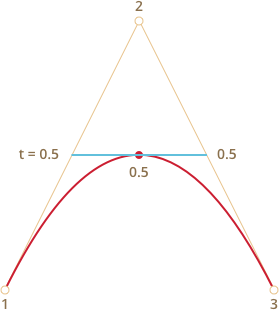

# 贝塞尔曲线

贝塞尔曲线用于计算机图形绘制形状，CSS 动画和许多其他地方。

<<<<<<< HEAD:3-animation/1-bezier-curve/article.md
他们其实非常简单，值得学习一次并且在矢量图形和高级动画的世界里非常受用。
=======
They are a very simple thing, worth to study once and then feel comfortable in the world of vector graphics and advanced animations.
>>>>>>> 08734734021aa128c13da2382fe8fa062677bb9f:7-animation/1-bezier-curve/article.md

## 控制点

[贝塞尔曲线](https://en.wikipedia.org/wiki/B%C3%A9zier_curve)由控制点定义。

这些点可能有 2、3、4 或更多。

例如，两点曲线：



三点曲线：


四点曲线：


如果仔细观察这些曲线，你会立即注意到：

1. **控制点不总是在曲线上**这是非常正常的，稍后我们将看到曲线是如何构建的。
2. **曲线的阶次等于控制点的数量减一**。
对于两个点我们能得到一条线性曲线（直线），三个点 — 一条二阶曲线，四个点 — 一条三阶曲线。
3. **曲线总是在控制点的[凸包](https://en.wikipedia.org/wiki/Convex_hull)内部：**

     

由于最后一个属性，在计算机图形学中，可以优化相交测试。如果凸包不相交，则曲线也不相交。因此，首先检查凸包的交叉点可以非常快地给出“无交叉”结果。检查交叉区域或凸包更容易，因为它们是矩形，三角形等（见上图），比曲线简单的多。

<<<<<<< HEAD:3-animation/1-bezier-curve/article.md
贝塞尔曲线绘制的主要重点 —— 通过移动曲线，曲线**以直观明显的**方式变化。
=======
**The main value of Bezier curves for drawing -- by moving the points the curve is changing *in intuitively obvious way*.**
>>>>>>> 08734734021aa128c13da2382fe8fa062677bb9f:7-animation/1-bezier-curve/article.md

尝试在下面的示例中使用鼠标移动控制点：

[iframe src="demo.svg?nocpath=1&p=0,0,0.5,0,0.5,1,1,1" height=370]

**可以注意到，曲线沿切线 1 -> 2 和 3 -> 4 延伸。**

经过一些练习后，很明显我们知道怎样通过放置控制点来获得所需要的曲线。通过连接几条曲线，我们几乎可以得到任何东西。

这里有一些例子：

  

<<<<<<< HEAD:3-animation/1-bezier-curve/article.md
## 数学

贝塞尔曲线可以使用数学方程式来描述。

很快我们就能看到 —— 没必要知道它。但是为了完整性 —— 请看这里。

给定控制点 <code>P<sub>i</sub></code> 的坐标：第一个控制点的坐标为 <code>P<sub>1</sub> = (x<sub>1</sub>, y<sub>1</sub>)</code>，第二个控制点的坐标为 <code>P<sub>2</sub> = (x<sub>2</sub>, y<sub>2</sub>)</code>，以此类推，曲线坐标由方程式描述，这个方程式依赖属于区间 `[0,1]` 的参数 `t`。

- 有两个控制点的曲线方程：

    <code>P = (1-t)P<sub>1</sub> + tP<sub>2</sub></code>
- 有三个控制点的曲线方程：

    <code>P = (1−t)<sup>2</sup>P<sub>1</sub> + 2(1−t)tP<sub>2</sub> + t<sup>2</sup>P<sub>3</sub></code>
- 有四个控制点的曲线方程：

    <code>P = (1−t)<sup>3</sup>P<sub>1</sub> + 3(1−t)<sup>2</sup>tP<sub>2</sub>  +3(1−t)t<sup>2</sup>P<sub>3</sub> + t<sup>3</sup>P<sub>4</sub></code>

这些是矢量方程。

我们可以逐坐标重写它们，例如 3 点曲线：

- <code>x = (1−t)<sup>2</sup>x<sub>1</sub> + 2(1−t)tx<sub>2</sub> + t<sup>2</sup>x<sub>3</sub></code>
- <code>y = (1−t)<sup>2</sup>y<sub>1</sub> + 2(1−t)ty<sub>2</sub> + t<sup>2</sup>y<sub>3</sub></code>

我们应该放置 3 个控制点的坐标，而不是 <code>x<sub>1</sub>、y<sub>1</sub>、x<sub>2</sub>、y<sub>2</sub>、x<sub>3</sub> 和 y<sub>3</sub></code>。

例如，如果控制点是 `(0,0)`、`(0.5, 1)` 和 `(1, 0)`，则方程式为：

- <code>x = (1−t)<sup>2</sup> * 0 + 2(1−t)t * 0.5 + t<sup>2</sup> * 1 = (1-t)t + t<sup>2</sup> = t</code>
- <code>y = (1−t)<sup>2</sup> * 0 + 2(1−t)t * 1 + t<sup>2</sup> * 0 = 2(1-t)t = –t<sup>2</sup> + 2t</code>

现在随着 `t` 从 `0` 到 `1` 变化，每个 `t` 对应的 `(x,y)` 集合可以构成曲线。

这可能太学术化了，对于曲线为什么看起来像这样以及它们如何依赖于控制点的描述并不是很明显。

所以绘制算法可能更容易理解。

## 德卡斯特里奥算法

[德卡斯特里奥算法](https://en.wikipedia.org/wiki/De_Casteljau%27s_algorithm)与曲线的数学定义相同，但直观地显示了曲线是如何被建立的。

让我们看看 3 个控制点的例子。
=======
## De Casteljau's algorithm

There's a mathematical formula for Bezier curves, but let's cover it a bit later, because
[De Casteljau's algorithm](https://en.wikipedia.org/wiki/De_Casteljau%27s_algorithm) it is identical to the mathematical definition and visually shows how it is constructed.

First let's see the 3-points example.
>>>>>>> 08734734021aa128c13da2382fe8fa062677bb9f:7-animation/1-bezier-curve/article.md

这里是一个演示，随后会有解释。

<<<<<<< HEAD:3-animation/1-bezier-curve/article.md
控制点可以用鼠标移动，点击 “play” 运行演示。
=======
Control points (1,2 and 3) can be moved by the mouse. Press the "play" button to run it.
>>>>>>> 08734734021aa128c13da2382fe8fa062677bb9f:7-animation/1-bezier-curve/article.md

[iframe src="demo.svg?p=0,0,0.5,1,1,0&animate=1" height=370]

**德卡斯特里奥算法构造三点贝塞尔曲线：**

1. 绘制控制点。在上面的演示中，它们标有：`1`、`2` 和 `3`。
2. 创造控制点 1 -> 2 -> 3 间的线段. 在上面的演示中它们是<span style="color:#825E28">棕色</span>的。
3. 参数 `t` 从 `0` to `1` 变化。 在上面的演示中取值 `0.05`：循环遍历 `0, 0.05, 0.1, 0.15, ... 0.95, 1`。

    对于每一个 `t` 的取值：

    - 在每一个<span style="color:#825E28">棕色</span>线段上我们取一个点，这个点距起点的距离按比例 `t` 取值。由于有两条线段，我们能得到两个点。

        例如，当 `t=0` — 所有点都在线段起点处，当 `t=0.25` — 点到起点的距离为线段长度的 25%，当 `t=0.5` — 50%（中间），当 `t=0.25` — 线段终点。

    - 连接这些点，下面这张图中连好的线被绘制成<span style="color:#167490">蓝色</span>。


| 当 `t=0.25`              | 当 `t=0.5`             |
| ------------------------ | ---------------------- |
|    |  |

<<<<<<< HEAD:3-animation/1-bezier-curve/article.md
4. 现在在<span style="color:#167490">蓝色</span>线段上取一个点，距离比例取相同数值的 `t`。也就是说，当 `t=0.25`（左图）时，我们取到的点位于线段的左 1/4 终点处，当 `t=0.5`（右图）时 — 线段中间。在上图中这一点是<span style="color:red">红色</span>的。
=======
4. Now in the <span style="color:#167490">blue</span> segment take a point on the distance proportional to the same value of `t`. That is, for `t=0.25` (the left picture) we have a point at the end of the left quarter of the segment, and for `t=0.5` (the right picture) -- in the middle of the segment. On pictures above that point is <span style="color:red">red</span>.
>>>>>>> 08734734021aa128c13da2382fe8fa062677bb9f:7-animation/1-bezier-curve/article.md

5. 随着 `t` 从 `0` to `1` 变化，每一个 `t` 的值都会添加一个点到曲线上。这些点的集合就形成的贝塞尔曲线。它在上面的图中是红色的，并且是抛物线状的。

这是三控制点的处理过程，但是对于 4 个点同样适用。

<<<<<<< HEAD:3-animation/1-bezier-curve/article.md
4 个控制点的演示（点可以被鼠标移动）：

[iframe src="demo.svg?p=0,0,0.5,0,0.5,1,1,1&animate=1" height=370]

算法：

- 控制点通过线段连接：1 -> 2、2 -> 3 和 3 -> 4。 我们能得到 3 条<span style="color:#825E28">棕色</span>的线段。
- 对于 `0` to `1` 之间的每一个 `t`：
    - 我们在这些线段上距起点距离比例为 `t` 的位置取点。把这些点连接起来，然后得到两条<span style="color:#0A0">绿色线段</span>。
    - 在这些线段上同样按比例 `t` 取点，得到一条<span style="color:#167490">蓝色线段</span>。
    - 在蓝色线段按比例 `t` 取点。在上面的例子中是<span style="color:red">红色</span>的。
- 这些点在一起组成了曲线。
=======
The demo for 4 points (points can be moved by a mouse):

[iframe src="demo.svg?p=0,0,0.5,0,0.5,1,1,1&animate=1" height=370]

The algorithm for 4 points:

- Connect control points by segments: 1 -> 2, 2 -> 3, 3 -> 4. There will be 3 <span style="color:#825E28">brown</span> segments.
- For each `t` in the interval from `0` to `1`:
    - We take points on these segments on the distance proportional to `t` from the beginning. These points are connected, so that we have two <span style="color:#0A0">green segments</span>.
    - On these segments we take points proportional to `t`. We get one <span style="color:#167490">blue segment</span>.
    - On the blue segment we take a point proportional to `t`. On the example above it's <span style="color:red">red</span>.
- These points together form the curve.
>>>>>>> 08734734021aa128c13da2382fe8fa062677bb9f:7-animation/1-bezier-curve/article.md

该算法是递归的，并且可以适应于任意数量的控制点。

<<<<<<< HEAD:3-animation/1-bezier-curve/article.md
给定 N 个控制点，我们将它们连接起来以获得初始的 N-1 个线段。

然后对从 `0` 到 `1` 的每一个 `t`：
- 在每条线段上按 `t` 比例距离取一个点并且连接 —— 会得到 N-2 个线段。
- 在上面得到的每条线段上按 `t` 比例距离取一个点并且连接 —— 会得到 N-3 个线段，以此类推……
- 直到我们得到一个点。得到的这些点就形成了曲线。

曲线的移动演示:

[iframe src="demo.svg?p=0,0,0,0.75,0.25,1,1,1&animate=1" height=370]

和其它的点：

[iframe src="demo.svg?p=0,0,1,0.5,0,0.5,1,1&animate=1" height=370]

环形：

[iframe src="demo.svg?p=0,0,1,0.5,0,1,0.5,0&animate=1" height=370]

非平滑贝塞尔曲线：

[iframe src="demo.svg?p=0,0,1,1,0,1,1,0&animate=1" height=370]

由于算法是递归的，我们可以构建任何顺序的贝塞尔曲线：使用 5 个、6 个或更多个控制点。但在实践中它们没那么有用。通常我们取 2-3 个点，对于复杂的线条，将几条曲线拼接在一起。这更容易开发和计算。

```smart header="如何通过给定点绘制曲线？"
我们使用控制点制作贝塞尔曲线。正如我们所见，它们并不在曲线上。或者更准确地说，第一个和最后一个在曲线上，但其它的不在。
=======
Given N of control points:

1. We connect them to get initially N-1 segments.
2. Then for each `t` from `0` to `1`, we take a point on each segment on the distance proportional to `t` and connect them. There will be N-2 segments.
3. Repeat step 2 until there is only one point.

These points make the curve.

```online
**Run and pause examples to clearly see the segments and how the curve is built.**
```


A curve that looks like `y=1/t`:

[iframe src="demo.svg?p=0,0,0,0.75,0.25,1,1,1&animate=1" height=370]

Zig-zag control points also work fine:

[iframe src="demo.svg?p=0,0,1,0.5,0,0.5,1,1&animate=1" height=370]

Making a loop is possible:

[iframe src="demo.svg?p=0,0,1,0.5,0,1,0.5,0&animate=1" height=370]

A non-smooth Bezier curve (yeah, that's possible too):

[iframe src="demo.svg?p=0,0,1,1,0,1,1,0&animate=1" height=370]

```online
If there's something unclear in the algorithm description, please look at the live examples above to see how
the curve is built.
```

As the algorithm is recursive, we can build Bezier curves of any order, that is: using 5, 6 or more control points. But in practice many points are less useful. Usually we take 2-3 points, and for complex lines glue several curves together. That's simpler to develop and calculate.

```smart header="How to draw a curve *through* given points?"
To specify a Bezier curve, control points are used. As we can see, they are not on the curve, except the first and the last ones.
>>>>>>> 08734734021aa128c13da2382fe8fa062677bb9f:7-animation/1-bezier-curve/article.md

有时我们有另一种任务：绘制一条曲线**通过几个点**，让它们都在一条平滑曲线上。这种任务叫[插值](https://en.wikipedia.org/wiki/Interpolation)，这里我们不覆盖讲解它。

<<<<<<< HEAD:3-animation/1-bezier-curve/article.md
这些曲线有数学方程式，例如[拉格朗日多项式](https://en.wikipedia.org/wiki/Lagrange_polynomial)。

在计算机图形中[样条插值](https://en.wikipedia.org/wiki/Spline_interpolation)通常用于构建连接多个点的平滑曲线。
```

## 总结
=======
There are mathematical formulas for such curves, for instance [Lagrange polynomial](https://en.wikipedia.org/wiki/Lagrange_polynomial). In computer graphics [spline interpolation](https://en.wikipedia.org/wiki/Spline_interpolation) is often used to build smooth curves that connect many points.
```


## Maths

A Bezier curve can be described using a mathematical formula.

As we saw -- there's actually no need to know it, most people just draw the curve by moving points with a mouse. But if you're into maths -- here it is.

Given the coordinates of control points <code>P<sub>i</sub></code>: the first control point has coordinates <code>P<sub>1</sub> = (x<sub>1</sub>, y<sub>1</sub>)</code>, the second: <code>P<sub>2</sub> = (x<sub>2</sub>, y<sub>2</sub>)</code>, and so on, the curve coordinates are described by the equation that depends on the parameter `t` from the segment `[0,1]`.

- The formula for a 2-points curve:

    <code>P = (1-t)P<sub>1</sub> + tP<sub>2</sub></code>
- For 3 control points:

    <code>P = (1−t)<sup>2</sup>P<sub>1</sub> + 2(1−t)tP<sub>2</sub> + t<sup>2</sup>P<sub>3</sub></code>
- For 4 control points:

    <code>P = (1−t)<sup>3</sup>P<sub>1</sub> + 3(1−t)<sup>2</sup>tP<sub>2</sub>  +3(1−t)t<sup>2</sup>P<sub>3</sub> + t<sup>3</sup>P<sub>4</sub></code>


These are vector equations. In other words, we can put `x` and `y` instead of `P` to get corresponding coordinates.

For instance, the 3-point curve is formed by points `(x,y)` calculated as:

- <code>x = (1−t)<sup>2</sup>x<sub>1</sub> + 2(1−t)tx<sub>2</sub> + t<sup>2</sup>x<sub>3</sub></code>
- <code>y = (1−t)<sup>2</sup>y<sub>1</sub> + 2(1−t)ty<sub>2</sub> + t<sup>2</sup>y<sub>3</sub></code>

Instead of <code>x<sub>1</sub>, y<sub>1</sub>, x<sub>2</sub>, y<sub>2</sub>, x<sub>3</sub>, y<sub>3</sub></code> we should put coordinates of 3 control points, and then as `t` moves from `0` to `1`, for each value of `t` we'll have `(x,y)` of the curve.

For instance, if control points are  `(0,0)`, `(0.5, 1)` and `(1, 0)`, the equations become:

- <code>x = (1−t)<sup>2</sup> * 0 + 2(1−t)t * 0.5 + t<sup>2</sup> * 1 = (1-t)t + t<sup>2</sup> = t</code>
- <code>y = (1−t)<sup>2</sup> * 0 + 2(1−t)t * 1 + t<sup>2</sup> * 0 = 2(1-t)t = –t<sup>2</sup> + 2t</code>

Now as `t` runs from `0` to `1`, the set of values `(x,y)` for each `t` forms the curve for such control points.

## Summary
>>>>>>> 08734734021aa128c13da2382fe8fa062677bb9f:7-animation/1-bezier-curve/article.md

贝塞尔曲线由其控制点定义。

贝塞尔曲线的两种定义方法：

<<<<<<< HEAD:3-animation/1-bezier-curve/article.md
1. 使用数学方程式。
2. 使用绘图过程：德卡斯特里奥算法
=======
1. Using a drawing process: De Casteljau's algorithm.
2. Using a mathematical formulas.
>>>>>>> 08734734021aa128c13da2382fe8fa062677bb9f:7-animation/1-bezier-curve/article.md

贝塞尔曲线的优点：

<<<<<<< HEAD:3-animation/1-bezier-curve/article.md
- 我们可以通过控制点移动来用鼠标绘制平滑线条。
- 复杂的形状可以由多条贝塞尔曲线组成。
=======
- We can draw smooth lines with a mouse by moving control points.
- Complex shapes can be made of several Bezier curves.
>>>>>>> 08734734021aa128c13da2382fe8fa062677bb9f:7-animation/1-bezier-curve/article.md

用途：

- 在计算机图形学，建模，矢量图形编辑器中。字体由贝塞尔曲线描述。
- 在 Web 开发中 — 用于 Canvas 上的图形和 SVG 格式。顺便说一下，上面的“实时”示例是用 SVG 编写的。它们实际上是一个 SVG 文档，被赋予不同的控制点做参数。你可以在单独的窗口中打开它并查源码：[demo.svg](demo.svg?p=0,0,1,0.5,0,0.5,1,1&animate=1)。
- 在 CSS 动画中描述动画的路径和速度。
